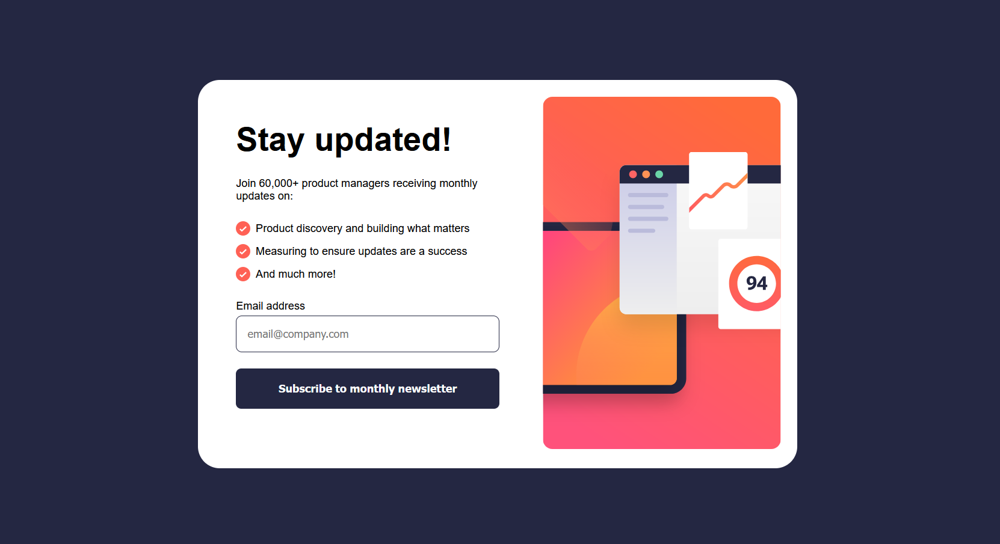

# Frontend Mentor - Newsletter sign-up form with success message solution

This is a solution to the [Newsletter sign-up form with success message challenge on Frontend Mentor](https://www.frontendmentor.io/challenges/newsletter-signup-form-with-success-message-3FC1AZbNrv). Frontend Mentor challenges help you improve your coding skills by building realistic projects.

## Table of contents

- [Overview](#overview)
  - [The challenge](#the-challenge)
  - [Screenshot](#screenshot)
  - [Links](#links)
- [My process](#my-process)
  - [Built with](#built-with)
  - [What I learned](#what-i-learned)
  - [Continued development](#continued-development)
  - [Useful resources](#useful-resources)
- [Author](#author)
- [Acknowledgments](#acknowledgments)

**Note: Delete this note and update the table of contents based on what sections you keep.**

## Overview

### The challenge

Users should be able to:

- Add their email and submit the form
- See a success message with their email after successfully submitting the form
- See form validation messages if:
  - The field is left empty
  - The email address is not formatted correctly
- View the optimal layout for the interface depending on their device's screen size
- See hover and focus states for all interactive elements on the page

### Screenshot



### Links

- Solution URL: [Github Repository](https://github.com/okayishmael/newsletter-sign-up-with-success-message)
- Live Site URL: [Github Live Page](https://okayishmael.github.io/newsletter-sign-up-with-success-message)

## My process

### Built with

- Semantic HTML5 markup
- CSS custom properties
- Flexbox
- Mobile-first workflow

### What I learned

- It is not required but I abled to a the email to an array.

- I learned that it is best practice to test right after the completion of an expected working component. This way you have shorter amount of code to debug.

- Misspelled words are the most common bug issue that is at the result of fast typing to get the project done I considerable profession time. Slow down a little and get it done right the first time.

I had to research and copy and this code below because I couldn't remember it. I still need some info on what it means.

```js
// Regular expression for validating email format

const emailPattern = /^[^\s@]+@[^\s@]+\.[^\s@]+$/;
```

### Continued development

- I Leverage my skill in JavaScript more and more.
- I am getting really awesome at CSS.

### Useful resources

- [Workik](https://www.workik.com) - This give in dept explination of why the bug was a bug. Getting explination behind the problem is good.

## Author

- Website - [Ishmael Sunday](https://www.linkedin.com/in/ishmael-sunday)
- Frontend Mentor - [@okayishmael](https://www.frontendmentor.io/profile/okayishmael)

## Acknowledgments

N/A
